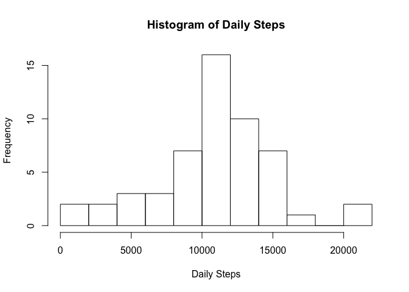
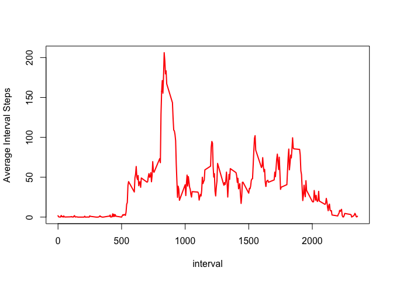
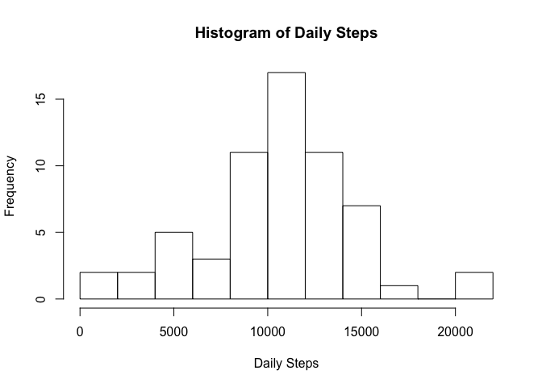
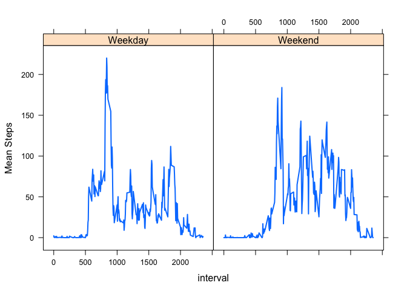

#### Code Libraries Used


```r
library(tidyverse)
library(lattice)
```


#### Loading and preprocessing the data
## Code for reading in the dataset and/or processing the data

The URL where the data can be found is here <https://d396qusza40orc.cloudfront.net/repdata%2Fdata%2Factivity.zip>.
But we can use the data zipped in this repository. In this case we can unzip the data directly to a tibble.


```r
activity <- read_csv(unz("activity.zip", "activity.csv"))
```

```
## Parsed with column specification:
## cols(
##   steps = col_double(),
##   date = col_date(format = ""),
##   interval = col_double()
## )
```

#### What is mean total number of steps taken per day?
## Histogram of the total number of steps taken each day

Summarize the data by grouping by date and summing steps then plot a histogram


```r
daily_activity <- activity %>% 
    group_by(date) %>%
    summarize(`Daily Steps`=sum(steps), .groups = 'drop')

with(daily_activity, hist(`Daily Steps`, breaks=10))
```

<!-- -->

## Mean and median number of steps taken each day

Get the specific summary statistics and print them after pasting them with a label


```r
print(paste0("Median: ",with(daily_activity ,summary(`Daily Steps`))[3]))
```

```
## [1] "Median: 10765"
```

```r
print(paste0("Mean: ",with(daily_activity ,summary(`Daily Steps`))[4]))
```

```
## [1] "Mean: 10766.1886792453"
```

#### What is the average daily activity pattern?
## Time series plot of the average number of steps taken per interval

Average number of daily steps will require a mean of the steps for each day.
Then the average steps per day can be plotted.


```r
average_interval_activity <-activity %>% 
    group_by(interval) %>%
    summarize(`Average Interval Steps`=mean(steps, na.rm=TRUE), .groups = 'drop')

with(average_interval_activity, plot(`Average Interval Steps` ~ interval, type = "l", lwd = 2, col = "red",))
```

<!-- -->

## The 5-minute interval that, on average, contains the maximum number of steps

In order to determine the average number of steps per interval then print the max


```r
max_interval <- average_interval_activity %>%
    arrange(desc(`Average Interval Steps`)) %>%
    slice(1) %>%
    pull(interval)

print(paste0("Interval with average maximum steps: ",max_interval))
```

```
## [1] "Interval with average maximum steps: 835"
```


#### Imputing missing values
## Code to describe and show a strategy for imputing missing data

Here is a simple function to print the NA values in the Activities data


```r
count_nas <- function(x, name){
    paste0("Number of NA values in ",name,": ",length(x[is.na(x)]))
}
print(count_nas(activity$steps, "Steps"))
```

```
## [1] "Number of NA values in Steps: 2304"
```

```r
print(count_nas(activity$interval, "Intervals"))
```

```
## [1] "Number of NA values in Intervals: 0"
```

```r
print(count_nas(activity$date, "Dates"))
```

```
## [1] "Number of NA values in Dates: 0"
```

To fill in the missing data I take the average of the median for the date interval for the preceeding and following two days of the missing values when availible.


```r
# Define median_intervals for date interval combinations
median_intervals <- activity %>% 
    group_by(date, interval) %>%
    summarize(median=median(steps, na.rm = TRUE), .groups = 'drop') %>%
    pivot_wider(names_from = date, values_from = median)

# Get just the intervals column
five_day_intervals <- median_intervals['interval']

# Then loop through each column and find the average for the col-2:col+2 frame when possible
# Then and add the new means to a five_day_intervals dataframe
max_col <- ncol(median_intervals)
for (col in 2:max_col){
    target_col <- colnames(median_intervals)[col]
    upper <- col+2
    if (upper > max_col){
        upper <- max_col
    }
    lower <- col-2
    if (lower < 2){
        lower <- 2
    }
    target <- median_intervals[,lower:upper] %>% 
        mutate(means = rowMeans(., na.rm=TRUE)) %>%
        select(means) %>%
        rename(!!target_col:=means)

    five_day_intervals <- cbind(five_day_intervals, target)
}

# Sort activity frame and add date.interval combo column to make sure each combination is represented
activity_sort <- activity %>%
    arrange(date, interval) %>%
    mutate(date.interval = paste0(date,interval))

# Restructure the five_day_intervals into a longer frame ordered the same way as activity_sort with all combos
imputed_day_intervals <- five_day_intervals %>%
    pivot_longer(!interval, names_to = "date", values_to = "steps") %>% 
    arrange(date, interval) %>%
    mutate(date.interval = paste0(date,interval))

# get NA rows
activity_na <- activity_sort %>%
    filter(is.na(steps)) %>%
    select(-date, -interval, -steps)

# get not NA rows
activity_notna <- activity_sort %>%
    filter(is.na(steps)==FALSE)

# fix NA rows
activity_fixed <- left_join(activity_na, imputed_day_intervals, by="date.interval")

# join fixed and not NA rows
activity_imputed <- rbind(activity_notna, activity_fixed) %>% 
    select(-date.interval) %>% 
    arrange(date, interval)


print(count_nas(activity_imputed$steps, "Steps"))
```

```
## [1] "Number of NA values in Steps: 0"
```

#### Are there differences in activity patterns between weekdays and weekends?
## Histogram of the total number of steps taken each day after missing values are imputed

Summarize the data by grouping by date and summing steps then plot a histogram


```r
daily_activity <- activity_imputed %>% 
      group_by(date) %>%
      summarize(`Daily Steps`=sum(steps), .groups = 'drop')

with(daily_activity, hist(`Daily Steps`, breaks=10))
```

<!-- -->

## Mean and median number of steps taken each day

Get the specific summary statistics and print them after pasting them with a label


```r
print(paste0("Median: ",with(daily_activity ,summary(`Daily Steps`))[3]))
```

```
## [1] "Median: 10571"
```

```r
print(paste0("Mean: ",with(daily_activity ,summary(`Daily Steps`))[4]))
```

```
## [1] "Mean: 10543.6926229508"
```

## Do these values differ from the estimates from the first part of the assignment?
Yes the differ.

## What is the impact of imputing missing data on the estimates of the total daily number of steps?
It appears to have shifted the mean and median to the left (in the direction of 0)


## Panel plot comparing the average number of steps taken per 5-minute interval across weekdays and weekends

Made weekdays and weekends factor then


```r
activity_imputed <- activity_imputed %>%
    mutate(Day = as.factor(ifelse(weekdays(date) %in% c("Saturday", "Sunday"), "Weekend", "Weekday")))

weekdays_activities <- activity_imputed %>%
    group_by(Day, interval) %>%
    summarize(`Mean Steps`=mean(steps), .groups = 'drop')


with(weekdays_activities, xyplot(`Mean Steps` ~ interval | Day, type = "l", lwd = 2))
```

<!-- -->


